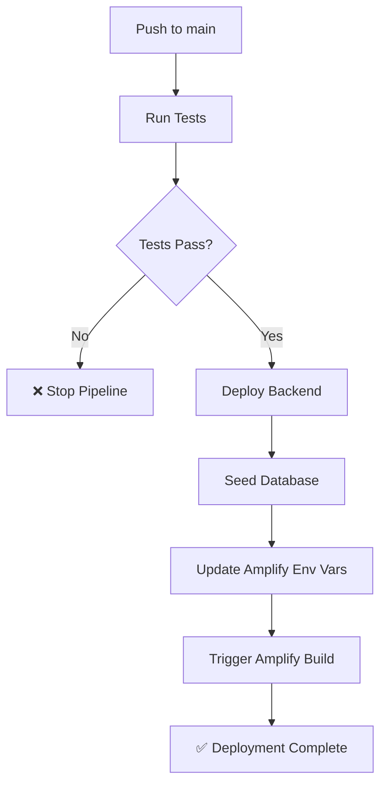

# 🚀 CI/CD Setup Instructions

Este documento explica cómo configurar el CI/CD pipeline para el deployment automático del backend y frontend.

## 📋 Prerequisites

- ✅ AWS Account configurada
- ✅ Backend ya desplegado manualmente una vez
- ✅ Frontend configurado en Amplify Console
- ✅ Permisos de AWS para GitHub Actions

## 🔑 GitHub Secrets Required

Ve a **Settings** → **Secrets and variables** → **Actions** en tu repositorio de GitHub y añade:

### Required Secrets:

| Secret Name             | Value     | Description                               |
| ----------------------- | --------- | ----------------------------------------- |
| `AWS_ACCESS_KEY_ID`     | `AKIA...` | AWS Access Key para GitHub Actions        |
| `AWS_SECRET_ACCESS_KEY` | `abcd...` | AWS Secret Access Key para GitHub Actions |

## 🎯 IAM Policy para GitHub Actions

Crea un usuario IAM dedicado para GitHub Actions con esta policy:

```json
{
  "Version": "2012-10-17",
  "Statement": [
    {
      "Effect": "Allow",
      "Action": [
        "cloudformation:*",
        "s3:*",
        "dynamodb:*",
        "appsync:*",
        "cognito-identity:*",
        "cognito-idp:*",
        "iam:*",
        "lambda:*",
        "logs:*",
        "amplify:*"
      ],
      "Resource": "*"
    }
  ]
}
```

## 🚀 Workflow Triggers

### 1. **Main Deployment** (`deploy.yml`)

- **Trigger**: Push/Merge to `main` branch
- **Actions**:
  - ✅ Test frontend & backend
  - 🏗️ Deploy backend infrastructure
  - 🌱 Seed database
  - 🌐 Update Amplify environment variables
  - 📢 Send notifications

### 2. **CI Testing** (`ci.yml`)

- **Trigger**: Pull requests & feature branches
- **Actions**:
  - 🔍 Lint & format checks
  - 🧪 Test frontend & backend
  - 🔒 Security audits
  - 📊 Generate reports

### 3. **Resource Cleanup** (`cleanup.yml`)

- **Trigger**: Manual dispatch only
- **Actions**:
  - 🧹 Destroy backend resources
  - 🧹 Destroy all resources (optional)

## 🔄 Deployment Flow



## 📊 Environment Variables

El pipeline automáticamente configura estas variables en Amplify:

- `NEXT_PUBLIC_GRAPHQL_ENDPOINT`
- `NEXT_PUBLIC_AWS_REGION`
- `NEXT_PUBLIC_IDENTITY_POOL_ID`

## 🛠️ Manual Commands

### Deploy Backend Only:

```bash
cd backend
bun run deploy:complete
```

### Deploy Frontend Only:

```bash
# Via Amplify Console trigger or:
cd website
bun run build
```

### Run CI Locally:

```bash
# Frontend tests
cd website && bun run lint && bun run build

# Backend tests
cd backend && npm test && npm run build
```

## 🔍 Monitoring & Debugging

### Check Deployment Status:

1. Go to **GitHub Actions** tab
2. Click on latest workflow run
3. Check each job status

### View AWS Resources:

1. **CloudFormation Console** → Check stack status
2. **Amplify Console** → Check build logs
3. **CloudWatch Logs** → Check function logs

### Common Issues:

#### ❌ AWS Permissions Error

- Verify IAM policy includes all required actions
- Check AWS credentials are valid

#### ❌ CDK Bootstrap Error

- Run: `npx cdk bootstrap aws://ACCOUNT/REGION`

#### ❌ Amplify Build Fails

- Check environment variables are set
- Verify `amplify.yml` configuration

## 📈 Best Practices

1. **Branch Protection**: Enable required status checks
2. **Code Review**: Require PR reviews before merge
3. **Testing**: All tests must pass before deployment
4. **Monitoring**: Set up CloudWatch alarms
5. **Rollback**: Keep previous versions for quick rollback

## 🆘 Emergency Procedures

### Rollback Deployment:

```bash
# Rollback backend
cd backend
npx cdk deploy BackendStack --rollback

# Rollback frontend via Amplify Console
```

### Stop All Deployments:

1. Go to GitHub Actions
2. Cancel running workflows
3. Use cleanup workflow if needed

---

**Next Steps**: Configure GitHub Secrets and test the pipeline! 🚀
